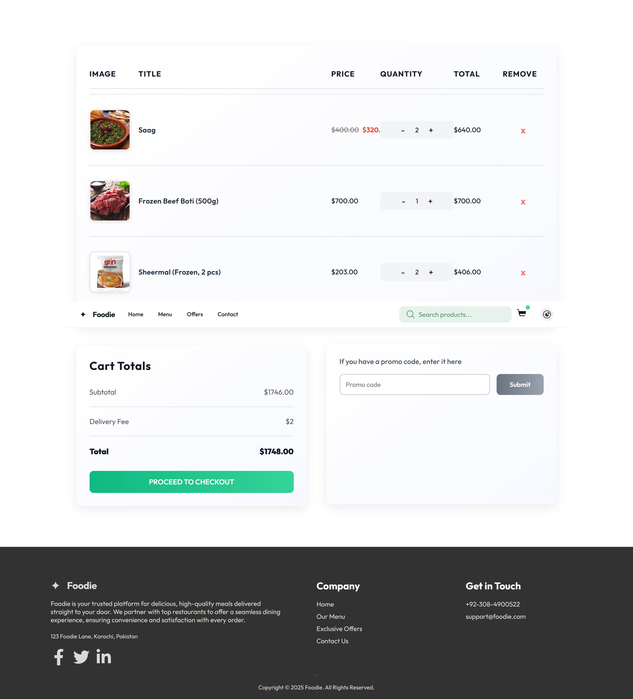
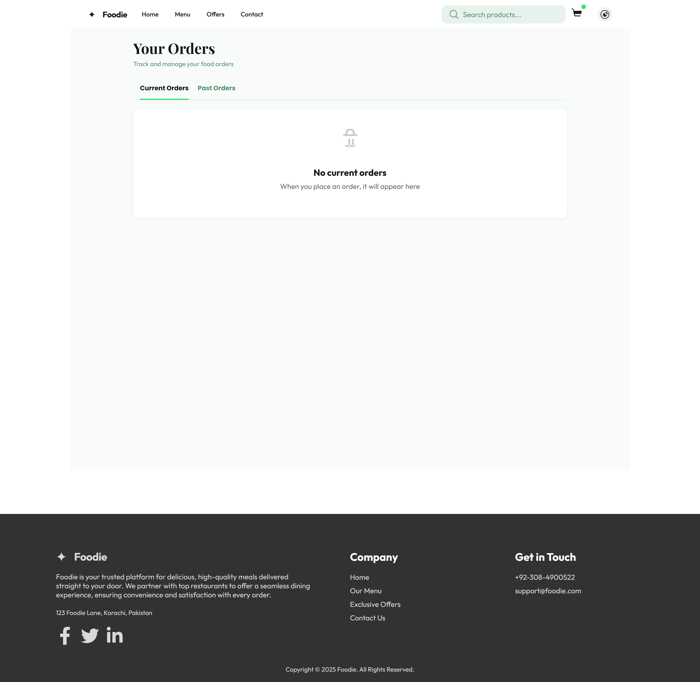
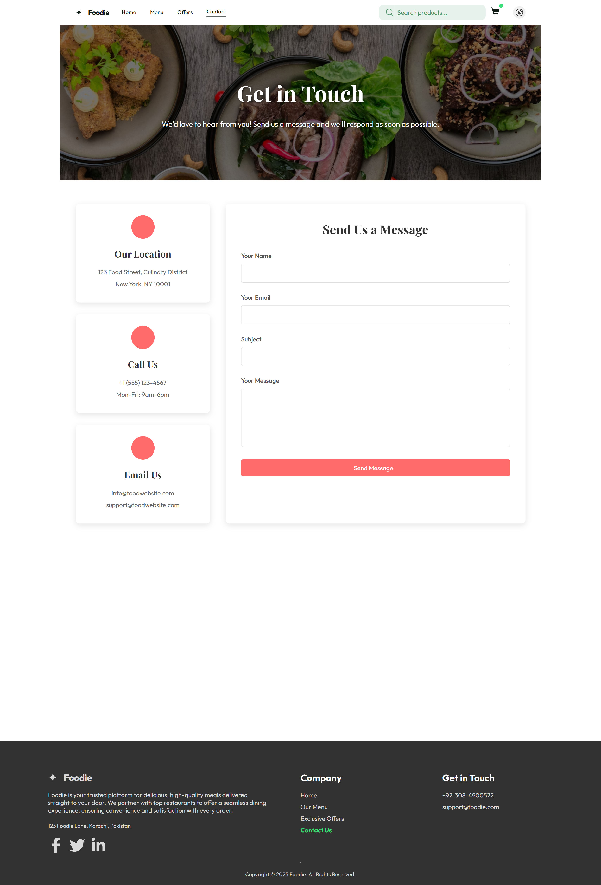
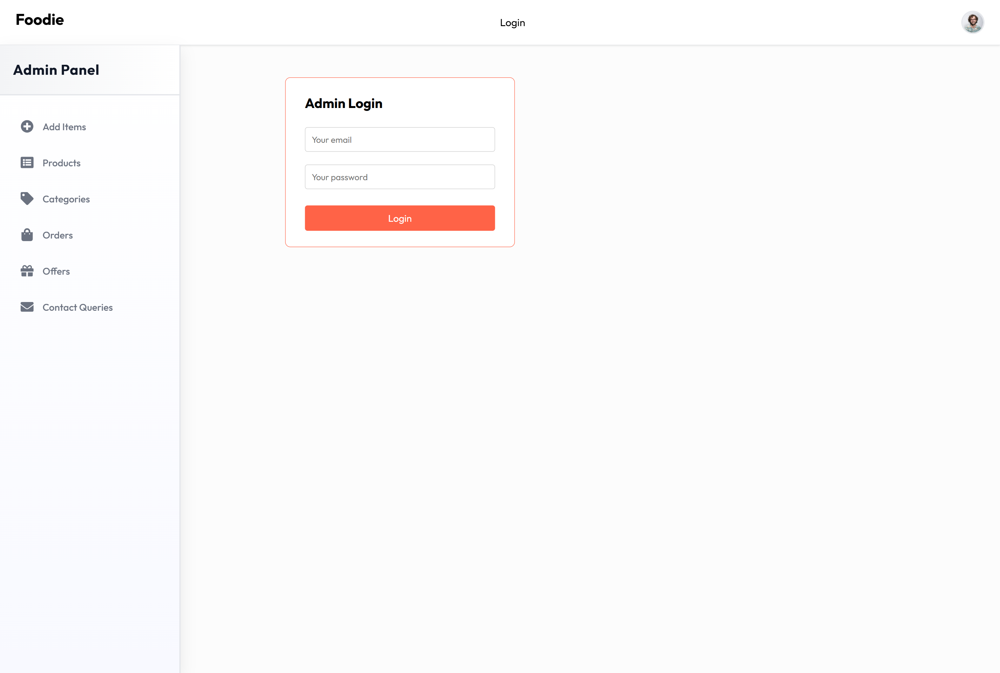
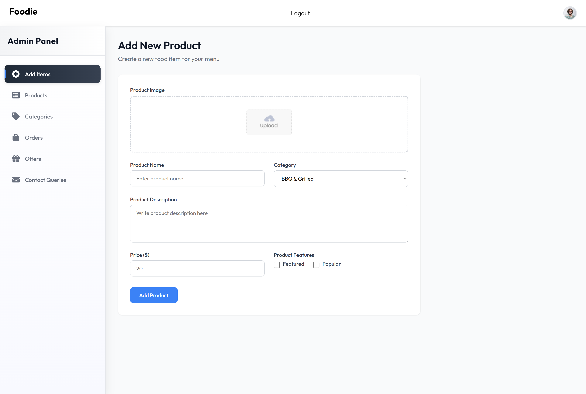
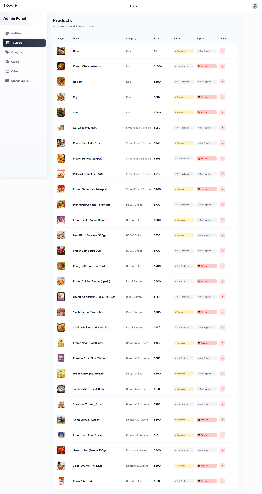
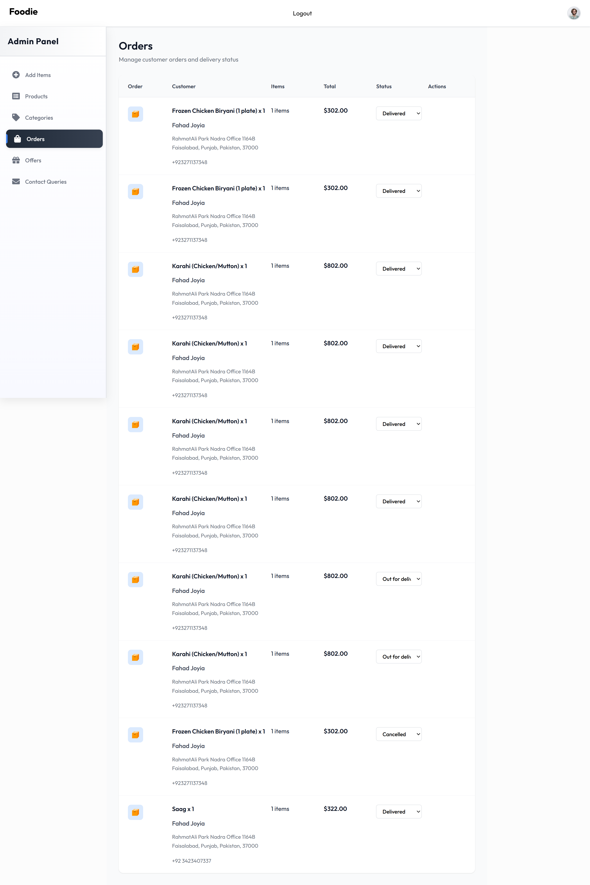
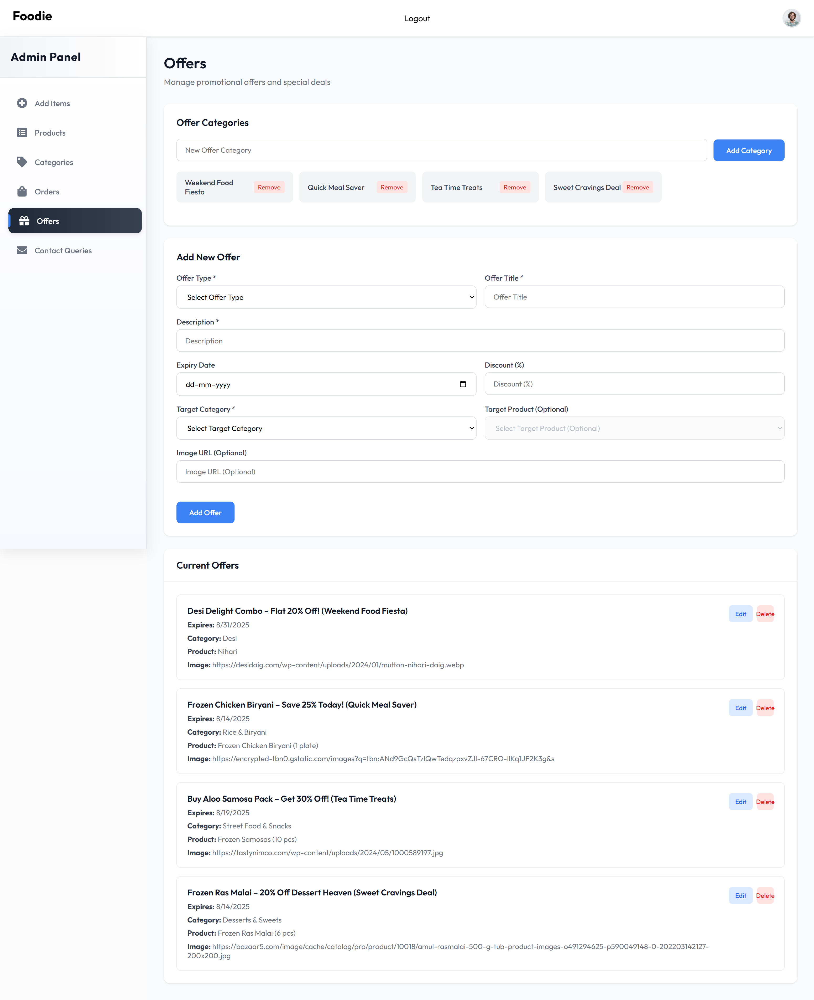
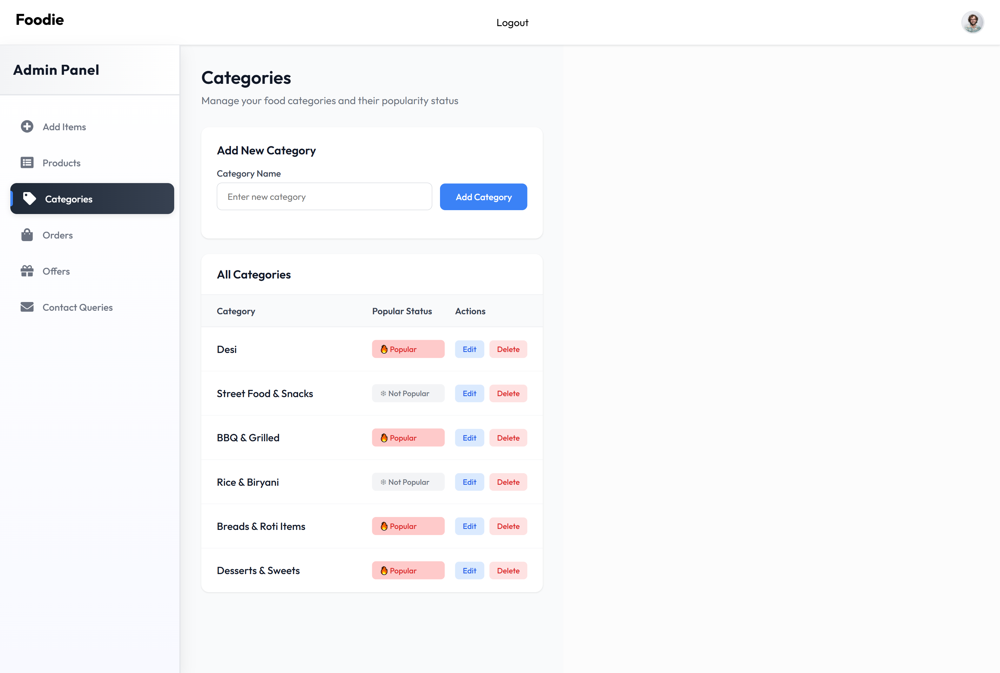
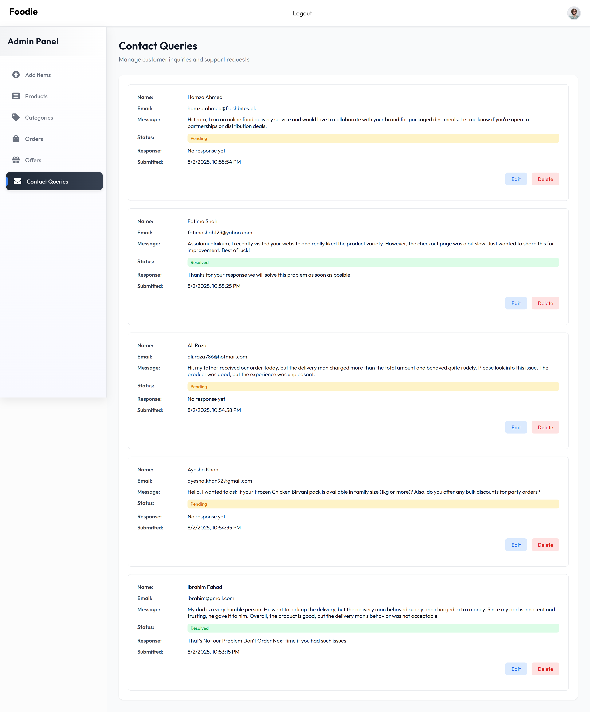

# 🍔 Food Delivery Web App

A complete **Food Delivery Web Application** with:
- **Frontend** for customers
- **Admin Panel** for restaurant/admin management
- **Backend API** for core logic and database communication

---

## 📦 Project Structure

```
Food-Delivery-main/
├── .gitignore
├── package-lock.json

├── admin/
│   ├── index.html, vite.config.js, public/
│   └── src/
│       ├── App.jsx, App.css, index.css, main.jsx
│       ├── components/ (Login, Navbar, Sidebar)
│       ├── context/
│       └── pages/ (Add, Category, Contact, List, Offers, Orders)

├── backend/
│   ├── .env, server.js, createDefaultAdmin.js
│   ├── config/, uploads/, middleware/
│   ├── controllers/
│   │   ├── authController.js, cartController.js, etc.
│   ├── models/
│   │   ├── Claim.js, Contact.js, Offer.js, User.js, etc.
│   └── routes/
│       ├── userRoute.js, foodRoute.js, etc.

├── frontend/
│   ├── index.html, vite.config.js, public/
│   └── src/
│       ├── App.jsx, index.css, main.jsx
│       ├── components/ (Navbar, Header, FoodDisplay, etc.)
│       ├── context/
│       └── pages/ (Cart, Contact, Menu, MyOrders, etc.)
```

---

## 🚀 Features

### 🌐 Frontend (User Interface)
- View and explore food categories
- Add items to cart
- Checkout and place orders
- View past orders
- Apply/claim offers
- Fully responsive and visually modern

### 🛠️ Backend (Node.js/Express)
- RESTful APIs for all entities (User, Order, Cart, etc.)
- MongoDB for database
- JWT-based authentication
- Image upload (e.g., for food images)
- Secure password storage using bcrypt

### 🛡️ Admin Panel
- Admin login
- Manage food items, offers, and categories
- Monitor orders and contacts
- Add/edit/remove items

---

## 🧪 Sample `.env` File (Backend)

```
MONGO_URL=mongodb://localhost:27017/foodapp
JWT_SECRET=your_jwt_secret
SALT=10
STRIPE_SECRET_KEY=your_stripe_secret_key
PORT=4000
```

---

## ⚙️ Setup Instructions

### 📋 Requirements

- Node.js (v18+ recommended)
- npm (comes with Node.js)
- MongoDB (local or cloud)
- Internet (for dependency installation)

---

### 📥 Step-by-Step Installation

1. **Install dependencies for all apps:**

```bash
cd backend
npm install

cd ../frontend
npm install

cd ../admin
npm install
```

---

2. **Set up environment variables:**

Create a `.env` file in the `/backend` folder:

```
MONGO_URL=mongodb://localhost:27017/foodapp
JWT_SECRET=your_jwt_secret
SALT=10
STRIPE_SECRET_KEY=your_stripe_secret_key
PORT=4000
```

Ensure MongoDB is running locally or use a cloud URL.

---

3. **Start Backend Server:**

```bash
cd backend
npm start
# or
node server.js
# or
npm run server
```

---

4. **Start Frontend App:**

```bash
cd frontend
npm run dev
```

---

5. **Start Admin Panel:**

```bash
cd admin
npm run dev
```

---

### 🔗 Access the Applications

- **Frontend (User Site)** → [http://localhost:5173](http://localhost:5173)
- **Admin Panel** → [http://localhost:5174](http://localhost:5174)
- **Backend API** → [http://localhost:4000](http://localhost:4000)

---

## 📷 Screenshots (Optional)

You can add screenshots in a `screenshots/` folder and include them like this:

```md

With the actual image names like this:

```md
## 📷 Screenshots

### 👤 User Interface







### 🛠️ Admin Panel









```

---

## 🧠 Author

**Muhammad Fahad Joyia**  
📫 [Your Email or Portfolio link]

---

## 📜 License

MIT License. Feel free to use, modify, and contribute!

---